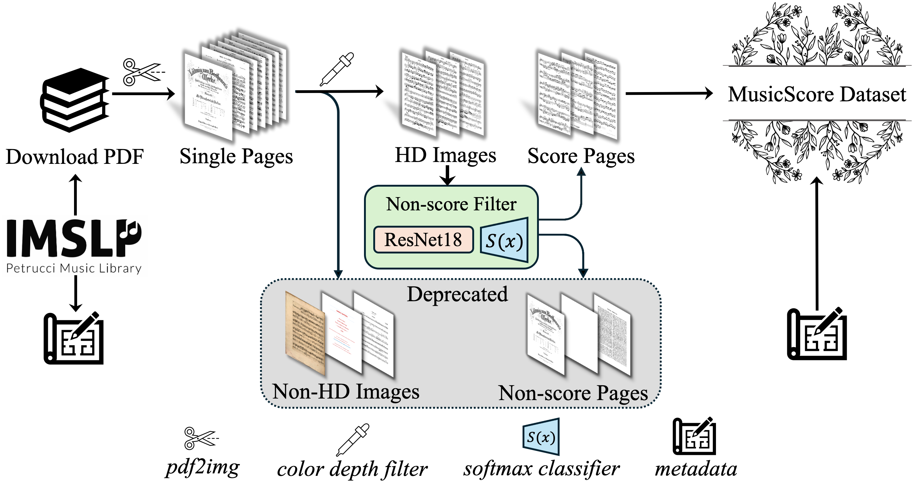
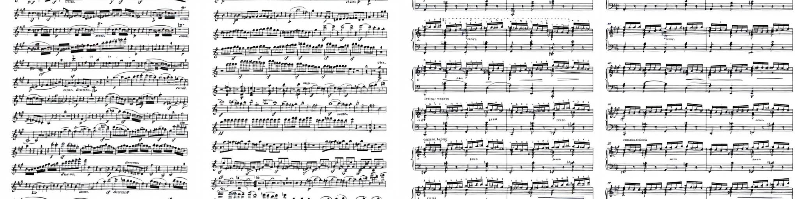

# MusicScore-script

Official toolkit for [paper](https://arxiv.org/abs/2406.11462): **MusicScore: A Dataset for Music Score Modeling and Generation**.

> [Yuheng Lin](https://rozenthegoat.github.io), [Zheqi Dai](https://github.com/dzq84) and [Qiuqiang Kong](https://github.com/qiuqiangkong)

This codebase contains two parts:

1. Two step scripts for cleaning sheet music score images, refers to [./data_process/](/data_process/).
2. Evaluation scripts for music score generation experiment for reproducing the [Fréchet Inception Distance](https://arxiv.org/abs/1706.08500) (FID) scores in Section 4.2, refers to [./evaluation/](/evaluation/).

Dataset download itself is not included in this codebase, please jump through this [portal](https://huggingface.co/datasets/ZheqiDAI/MusicScore/).



---

# Data process

This codebase maintains two steps of filtering sheet music score images.

## 1. Color depth filter

We distinguish whether an image is high quality or not by identifying color depth. The color depth of 1-bit corresponds to black and white images, while the color depth of 8-bit or 16-bit corresponds to color images. The color depth filter script is provided [here]().

## 2. Non-score filter

We implement a classification model to filter score and non-score images, refers to [cover.ipynb](data_process/non_cover_filter/cover.ipynb). The notebook contains:

- Training and inferencing scripts of non-score filter model.
- Processing script of restoring `hd_data` after applying the classification model.
- Evaluation script of non-score filter model.

The training and testing dataset locates in [./cover_data/](./cover_data/), containing 450 and 50 images respectively. We also provide trained [model checkpoint](data_process/non_cover_filter/2048-cover.pth) which can be loaded for inference.

Our cover and non-cover classification achieved a 90% accuracy on our test dataset. The evaluation metrics are presented in the table below:

| Class        | Precision | Recall | F1-score | Support |
| ------------ | --------- | ------ | -------- | ------- |
| Non-score    | 0.9524    | 1.0000 | 0.9756   | 20      |
| Score        | 1.0000    | 0.9667 | 0.9831   | 30      |
| Accuracy     |           | 0.9800 |          | 50      |
| Macro avg    | 0.9762    | 0.9833 | 0.9793   | 50      |
| Weighted avg | 0.9810    | 0.9800 | 0.9801   | 50      |

### \*Add-on:

We also provide multi-processing enhanced [pdf2img script](./data_process/pdf2img.py) that we used to slice music score PDF files into single page images. The script can be migrated to any tasks that requires PDF to image slicing.

---

# Evaluation

In paper, we conduct music score generation experiment which is a image generation task driven by text. We fine-tuned [Stable Diffusion 2.0](https://github.com/Stability-AI/stablediffusion/) using [stable-diffusion-2-base](https://huggingface.co/stabilityai/stable-diffusion-2-base) checkpoint. In Section 4.2, we performed evaluation by calculating FID-_k_ scores on different amount of samples in three subsets, where _k_ represents the amount of samples. We provide inferencing scripts of text-to-score generation, refers to [t2i_eval.py](./data_process/t2i_eval.py). Example usage:

```
python evaluation/t2i_eval.py \
    --scale "MS-400"          \  # choose from ["MS-400","MS-14k","MS-200k"]
    --data_dir /path/to/your/real_images
```

The FID calculation requires [pytorch-fid](https://github.com/mseitzer/pytorch-fid) library which can installed by `pip install pytorch-fid`. For our use case, run:

```
python -m pytorch_fid         \
    /path/to/real_images      \
    /path/to/generated_images \
    --device cuda:0           \
    --num-workers 14
```

In our experiment, we perform all inferences under 512x512 resolution. We use [DDIM Sampler](https://arxiv.org/abs/2010.02502) with 250 DDIM sampling steps. We guide our generation using [Classifier-Free Guidance](https://arxiv.org/abs/2207.12598) with CFG = 4.0. The evaluation result in our paper refers to the table below.

| Subset | [MusicScore-400](https://huggingface.co/datasets/ZheqiDAI/MusicScore/tree/main/MisicScore-400) | [MusicScore-14k](https://huggingface.co/datasets/ZheqiDAI/MusicScore/tree/main/MisicScore-14k) | [MusicScore-200k](https://huggingface.co/datasets/ZheqiDAI/MusicScore/tree/main/MisicScore-200k) |
| ------ | ---------------------------------------------------------------------------------------------- | ---------------------------------------------------------------------------------------------- | ------------------------------------------------------------------------------------------------ |
| FID-8  | 114.65                                                                                         | 297.60                                                                                         | 294.76                                                                                           |
| FID-16 | 85.81                                                                                          | 221.42                                                                                         | 314.06                                                                                           |
| FID-32 | 84.33                                                                                          | 255.00                                                                                         | 264.02                                                                                           |
| FID-64 | 74.46                                                                                          | 229.16                                                                                         | 261.28                                                                                           |

A sample generated result refers to the figure below.



> Prompt (starting from left):
>
> - a music score, instrumentation is violin, key is A major
> - a music score, instrumentation is violin
> - a music score, instrumentation is piano, key is A major
> - a music score, instrumentation is piano

---

## License

The data, code and model weights are licensed under CC-BY 4.0.

## BibTeX

If you use related contents about this work, do consider citing this work using the following BibTeX entries:

```bibtex
@misc{lin2024musicscore,
      title={MusicScore: A Dataset for Music Score Modeling and Generation},
      author={Yuheng Lin and Zheqi Dai and Qiuqiang Kong},
      year={2024},
      journal={arXiv preprint arXiv:2406.11462},
}
```

```bibtex
@misc{dai2024msscript,
  author={Zheqi Dai, Yuheng Lin and Qiuqiang Kong},
  title={{MusicScore-script: Data Processing Toolkit}},
  month={June},
  year={2024},
  note={Version 0.1.0},
  howpublished={\url{https://github.com/dzq84/MusicScore-script}},
}
```
